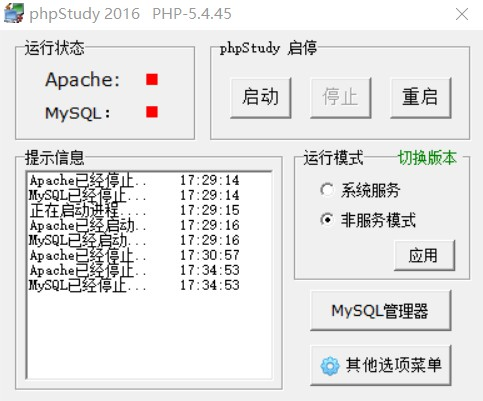

# about
项目基于Vue3 + element-plus 构建。后台采用的是黑马课程提供的本地后台。所有数据都是通过访问这个本地后台得到。(尽管这个后台有点毛病)
## 技术栈
vue3 + vue-router + vuex + vite +  ES6/7 + sass + element-ui-plus

## 项目运行
* 运行数据库

* 进入Server/webServer, 运行数据库服务器
  ```
    node .\app.js
  ```
* 运行项目
  ```
    yarn dev
  ```

## 功能列表
- 登录注销
- 用户管理
  - 用户列表
- 权限管理
  - 角色列表
  - 权限列表
- 商品管理
  - 商品列表
  - 分类参数
  - 商品分类
- 订单管理
  - 订单列表
- 数据统计
  - 数据报表

## 部分截图


